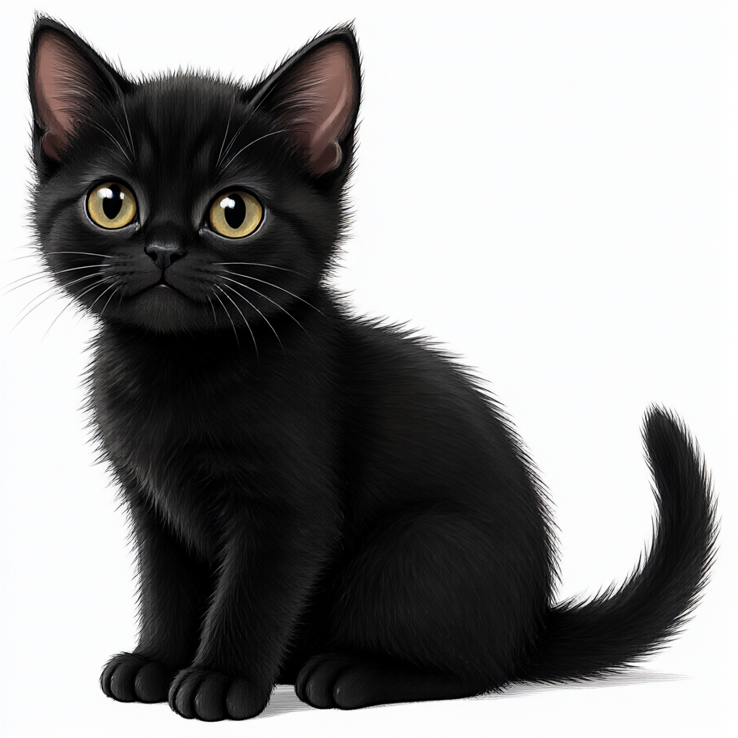
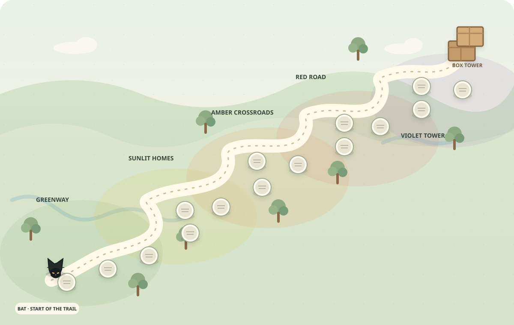

# BAT's Insurance Adventure

A browser-based Property & Casualty learning adventure for Kansas. The learner follows BAT through fifteen lessons, studies the supplied manual, and completes CAT's final assessment.

**Play online:** <https://branamops.github.io/BAT/>

**Source repository:** <https://github.com/BranamOps/BAT>

## Meet BAT



## The adventure map



## How to play

1. Choose **Begin the journey** or click Lesson 1 on the map.
2. Read the short lesson, then choose **Start the 10-question lesson check**.
3. Select an answer and click **Check answer**. The game immediately shows an explanation and a reference to the training manual.
4. Score at least **8 out of 10** to master a lesson and unlock the next stop. If needed, choose **Review & retake**.
5. Complete all **15 lessons**, then meet CAT for the final assessment.

Your progress is saved in this browser on this device. It does not automatically sync between computers or browsers. Use **The manual** in the app for a section and page guide.

## Run locally for testing

On Windows, double-click **START BAT Adventure.cmd**. It starts a temporary local web server and opens the game in your browser. Keep the server window open while testing; close it when finished. Python 3 is required. This is the single supported local launcher.

Do not open `index.html` directly from File Explorer (`file://`): the game fetches lesson and question data, so use the launcher or the public website instead.

## Project files and assets

- `index.html`, `app.css`, `app.js` — page shell, styling, and game behavior.
- `data/` — lesson curriculum and the 192-question bank.
- `assets/BAT.png` — BAT character art; this is also displayed above on GitHub's repository page.
- `assets/world.svg` — the illustrated winding map, also shown above.
- `assets/Insurance Training Manual.pdf` — source manual used for lesson content and quiz citations.

All artwork and the supplied manual are grouped under `assets/`. Moving files changes their web paths, so code and document references must use the new `assets/...` paths. The app now loads BAT from `assets/BAT.png`, and the map has always loaded from `assets/world.svg`. The manual is a PDF and cannot serve as a browser redirect; the game uses its actual filename in citations, while the content/page guide is in the app's **The manual** section. Do not open the PDF as though it were an app page.

Freebuff's local workspace metadata folder `.freebuff/` is excluded by `.gitignore` and should never be committed or published.

## Publish changes

The `main` branch deploys to GitHub Pages through `.github/workflows/static.yml`. The beginner tutorial is at [`C:\dev\github_tutorial.md`](../github_tutorial.md). From PowerShell, the normal sequence is:

```powershell
cd C:\dev\BAT
git pull --ff-only origin main
git status --short
git add .
git status --short
git commit -m "Describe the change"
git push origin main
```

Review `git status` before committing and stage only intended files. Then check the repository's **Actions** tab for a successful Pages deployment and reload the public site. Deployment can take several minutes.
